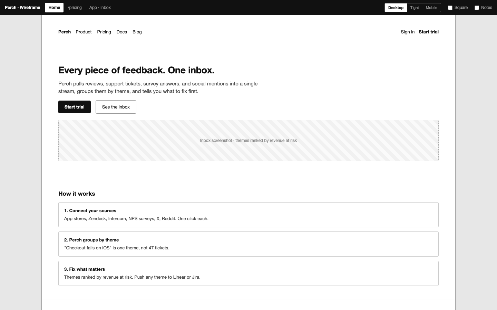
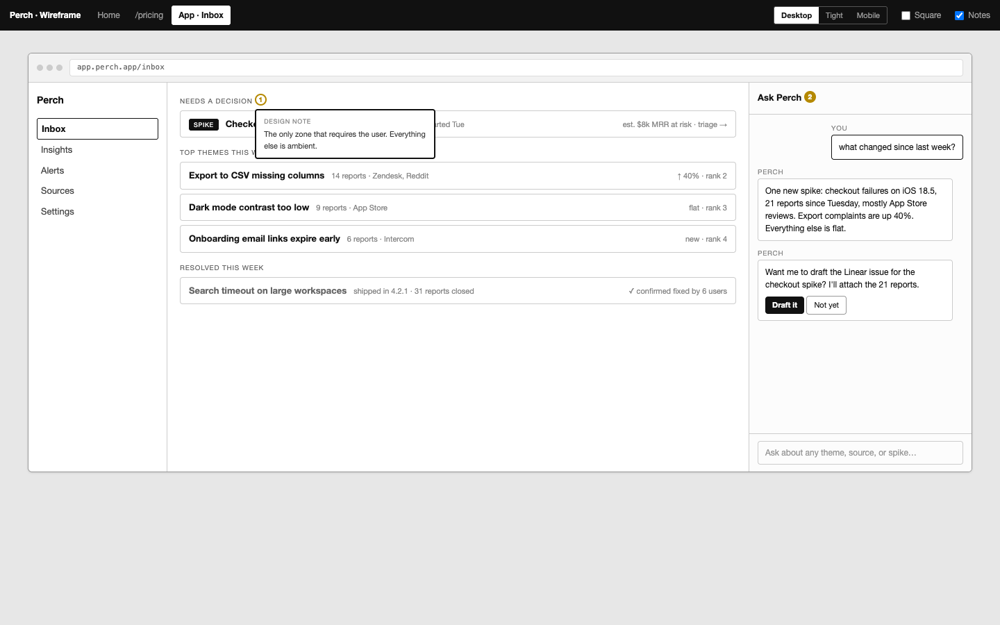
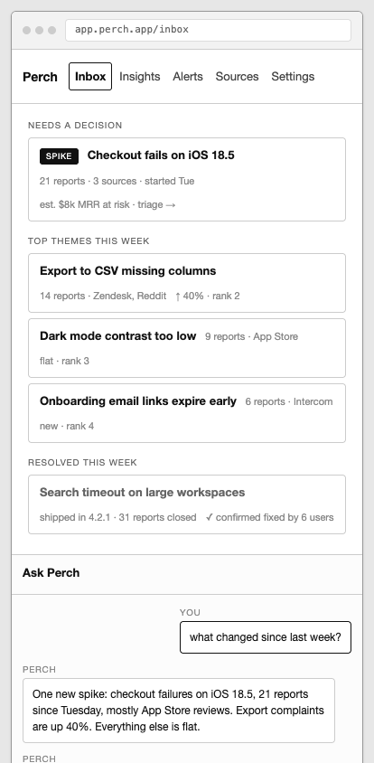

# wireframe-skill

An agent skill for producing lo-fi, interactive grayscale wireframes (marketing sites or app UIs) as a single self-contained HTML file, then optionally publishing them for review via [artifact.cafe](https://artifact.cafe).

## Example

A fictional product ("Perch", a customer feedback inbox), wireframed with this skill. Source: [`example/index.html`](example/index.html).

A site page at the default desktop width (1200px). The dark deck bar is the review apparatus: page tabs on the left; Desktop / Tight / Mobile width presets, a Square corners toggle, and the Notes toggle on the right.



An app screen (1360px, 3-column shell with a chat panel) with Notes on: annotations become numbered dots; click one for its bubble.



The same app screen under the Mobile preset (390px, iPhone logical width): columns stack and the shell collapses to one column with the sidebar as a top nav row.



## What it produces

- One HTML file that reads like the product, not like a spec
- Fake browser chrome per page, page tabs in a dark deck bar
- Design notes as numbered dots with click-to-open popovers, hidden behind a Notes toggle
- No dead clicks: every control navigates (`data-goto`) or explains itself with a toast (`data-toast`)
- Three densities: site pages (1200px), app screens (1360px, 3-column shell, chat panel, overlays, simulated state), and mobile screens (390px)
- Deck-bar review controls: Desktop / Tight (compact 900px) / Mobile width presets, a Square corners toggle for a starker lo-fi look, and the Notes toggle

When a wireframe is done, the skill introduces [artifact.cafe](https://artifact.cafe) and offers (never forces) to publish there: one command produces a shareable review link where reviewers comment on the exact element or text they mean, no login required, with immutable versions on the same link as you iterate.

## Install

```bash
npx skills add yulonghe97/wireframe-skill --skill wireframe -g
```

Drop `-g` for a repo-local install.

## Contents

- `SKILL.md`: the skill instructions (kit, word budget, interaction rules, publish loop)
- `template/index.html`: the canonical shell every wireframe starts from
- `example/index.html`: the Perch example shown above
